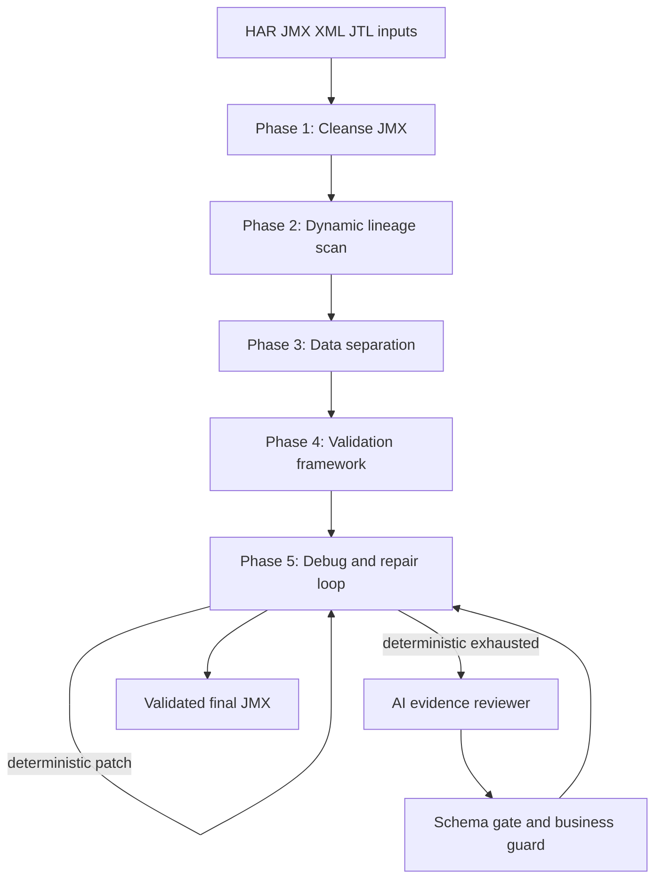

# JMeter Script Agent Blueprint Design

Generated: 2026-07-08

## Purpose

Upgrade `perfscript-local` from a strong local generator/validator into a blueprint-driven JMeter script creator agent. The agent should behave like a senior performance engineer: clean the raw script, map server-issued state, separate business data, prove functional success, debug failures chronologically, and use AI only after deterministic evidence has been exhausted.

The first implementation pass should prioritize closed-loop repair. Cleanup, correlation, validation, and AI prompt changes should all serve that loop instead of becoming independent feature work.

## Current State

The app already has several pieces of the blueprint:

- `src/ingest.js` accepts HAR, JMX, response sidecars, dual HAR, and dual JMX inputs.
- `src/generate.js` filters noise, generates JMX, applies parameterization, injects assertions, handles polling, applies load profile settings, rewrites hosts, and performs extra correlation passes.
- `src/replay-correlate.js` builds producer-to-consumer links and can replay with live values, but it is not yet wired into the normal `--agent` flow.
- `src/runner.js` drives JMeter, guards business samplers, escalates to AI, applies schema-gated patches, and re-verifies.
- `src/llm-patcher.js` intentionally limits AI output to safe patch shapes.
- `src/business-guard.js` prevents easy false-green behavior caused by disabling important samplers.

The gap is orchestration. The current pipeline has many useful transforms, but the agent does not yet run them as a named evidence pipeline where each phase feeds the next phase and the earliest root failure controls repair.

## Operating Model

The upgraded agent should run the blueprint as a five-phase workflow:



AI is a bounded reviewer and patch proposer. It should not be the first repair engine. It should receive structured evidence from the first failing sampler, the producer/consumer map, relevant JMX snippets, and known protected samplers.

## Data Contract

Introduce a `BlueprintAgentContext` object that is passed between phases. It can start as a plain JavaScript object to avoid heavy framework work.

```js
{
  entries,
  secondaryEntries,
  pages,
  mode,
  outDir,
  name,
  runCfg,
  agentCfg,
  jmxPath,
  xml,
  cleanups: [],
  lineage: {
    links: [],
    orphans: [],
    dynamics: [],
    producersByValue: {}
  },
  dataModel: {
    csvFile: null,
    parameters: [],
    protectedBusinessFields: []
  },
  validation: {
    assertions: [],
    softFailureRules: [],
    businessGuard: null
  },
  loop: {
    attempts: [],
    firstFailure: null,
    patches: []
  },
  ai: {
    promptEvidence: null,
    acceptedFixes: [],
    rejectedFixes: []
  }
}
```

The context should be serialized into output artifacts such as `_blueprint_context.json`, `_lineage.json`, and `_repair_rounds.json` so a human can audit why the agent changed the JMX.

## Phase 1: Parse, Cleanse, and Restructure

Phase 1 should normalize the generated or ingested JMX before correlation and validation.

Responsibilities:

- Drop or disable static assets and third-party telemetry by default, while preserving operator overrides through `run.disableCalls` and future `run.includeCalls`.
- Convert hardcoded environment details into root-level user-defined variables, for example `PROTOCOL`, `BASE_HOST`, `PORT`, and optionally `BASE_URL`.
- Ensure HTTP Cookie Manager and HTTP Cache Manager exist at the thread group level. Cookie Manager should clear cookies each iteration for clean browser-like virtual users.
- Normalize common headers into a parent Header Manager where safe. Sampler-specific headers such as `Content-Type: application/json` must remain attached to the sampler that needs them.
- Enforce HTTP method and payload fidelity. If a sampler has a JSON body, it must carry `Content-Type: application/json`.
- Keep static asset behavior browser-realistic by preferring "Retrieve All Embedded Resources" plus a concurrent pool for page samplers instead of replaying every image/font/js asset as an explicit sampler.

Current integration points:

- Extend `src/transforms.js` with small pure transforms for environment UDV normalization, manager injection, common-header lift, and JSON content-type enforcement.
- Call those transforms from `src/generate.js` after render and before validation/repair.
- Reuse existing `disableSamplersByPattern` for noise removal, but keep app-specific patterns in config.

Out of scope for the first pass:

- Full DOM-aware conversion of static resource requests into embedded resource flags for every page shape. The first pass should record the intended transform and implement conservative cases only.

## Phase 2: Dynamic State and Lineage Mapping

Phase 2 is the core senior-engineer behavior. The agent should trace every dynamic request value backward to its producer.

Responsibilities:

- Scan request URL, query, body, and headers for candidate dynamic values.
- Search prior response bodies and headers for each candidate.
- Prefer dual-recording variance when available. Single-recording entropy checks are a fallback, not the primary proof.
- Classify producer location:
  - JSON body: JSON extractor. The implementation can use JSONPostProcessor first because that is already supported. A JMESPath-specific strategy can be added if JMeter plugin availability is proven.
  - XML or HTML body: Boundary Extractor when stable left/right anchors exist, otherwise CSS/HTML extractor for form fields.
  - Response headers and Set-Cookie: Regex Extractor with header scope.
  - Client-generated values: native JMeter functions when possible, otherwise explicit manual-required output.
- Use clear correlated variable names with the `c_` prefix, for example `c_csrfToken`, `c_userId`, `c_state_2`.
- Verify every extractor against the recorded producer before substituting a variable into consumers.

Current integration points:

- Promote `src/replay-correlate.js` from standalone module to the first deterministic agent step inside `src/runner.js`.
- Reuse `src/extractors.js` for native extractor planning.
- Reuse `src/auto-correlate.js` for dual-recording body/session correlation, but align variable naming with the `c_` convention.
- Call the tested `rewireClientMintedOauthVars()` from `src/generate.js`; it is currently exported and tested but not part of the generation path.

## Phase 3: Parameterization and Test Data Separation

Phase 3 should prevent iteration-two failures caused by hardcoded business data.

Responsibilities:

- Detect credentials, search terms, form fields, unique names, dates, and mutating request payload values.
- Keep protocol documents static. For example, GraphQL query text is code, not test data.
- Add a CSV Data Set Config near the top of the thread group.
- Use explicit sharing mode. The default should be `shareMode.all` unless the operator config requests current thread group isolation.
- Generate unique rows for fields likely to hit uniqueness constraints.
- Preserve secrets handling. Passwords and bearer tokens must not be written into shareable artifacts.

Current integration points:

- `src/generate.js` already calls `suggestParameterizations()` and `synthesizeCsv()`.
- Extend the generated `_parameters.json` with a classification reason and sharing mode.
- Add config support for `run.csvShareMode`.

## Phase 4: Validation Framework

Phase 4 should make GREEN mean the business flow worked, not merely that JMeter received HTTP 200.

Responsibilities:

- Inject one meaningful assertion per major transaction or API milestone.
- Prefer specific markers: JSON success flags, IDs, redirect landing markers, page titles tied to the target state, and transaction-created identifiers.
- Detect soft failures inside 200 responses, including strings or JSON fields such as `error`, `errors`, `Session Expired`, `Unauthorized`, `invalid_token`, or application-specific failure codes.
- Keep bridge pages and transient redirect pages assertion-light; they often disappear during a correct redirect-following replay.
- Require protected business samplers to execute and pass.

Current integration points:

- `src/transforms.js` already has `injectAssertionsFromMined()`.
- `src/business-guard.js` already identifies and protects business samplers.
- `src/verifier.js` already compares status, length, and JSON shape when data is available.

First-pass improvements:

- Add a soft-failure scanner that can run against saved response bodies when available and against assertion messages/JTL fields otherwise.
- Add `run.softFailurePatterns` and `run.businessSuccessMarkers` config fields.
- Include validation decisions in `_reasoning.md` and the HTML report.

## Phase 5: Iterative Debug and Fix Loop

Phase 5 should be the first closed-loop implementation target.

Responsibilities:

- Run with 1 thread and 1 iteration first.
- Attach debug-only artifacts in agent mode: Debug Sampler/View Results Tree or equivalent JTL/debug variables. These must not ship in the final JMX unless explicitly requested.
- Analyze failures chronologically and patch only the earliest root cause.
- Classify root failure:
  - 401/403: failed auth/session/csrf correlation or missing cookie/header propagation.
  - 400/500: payload structure, stale dynamic ID, content type, missing body variable, or server-side validation failure.
  - Unresolved `${var}`: extractor not placed before consumer, disabled producer, or failed extractor expression.
  - Soft failure under 200: invalid business state despite HTTP success.
- Re-run after each deterministic patch.
- After 1x1 is clean, run 2 threads and 2 iterations to prove CSV/data/thread safety.
- Only then write the top-sorted final JMX pointer.

Current integration points:

- Extend `runValidate()` in `src/runner.js`.
- Insert a deterministic replay-driven round before `tryMemoryPatchRound()` and `runLlmPatchRounds()`.
- Use `recoverSamplesFromJtl()` and `applyBusinessVerification()` after every run.
- Store loop artifacts in `_repair_rounds.json`.

## AI Behavior

AI should follow the same blueprint, with hard constraints in `src/runner.js` prompt construction.

Required AI evidence fields:

- failing sampler name and index,
- response code and message,
- root-cause category,
- producer sampler, if known,
- consumer sampler,
- exact value location,
- proposed extractor type,
- exact parent sampler where the extractor belongs,
- whether the patch touches a protected business sampler.

Allowed AI patch kinds remain intentionally small for the first pass:

- `addExtractor`
- `replaceValueWithVar`
- `setSamplerEnabled`

Changes to prompt behavior:

- Force chronological root-cause analysis.
- Instruct AI to omit fixes when producer/consumer evidence is not visible.
- Require `c_` variable names for new correlations.
- Require sampler-local `Content-Type: application/json` fixes to be represented by a new future safe patch kind, not arbitrary XML. Until that patch kind exists, AI must report no auto-fix for that issue.

Future patch kinds, after tests:

- `setHeader`
- `setHttpDefaults`
- `addManager`
- `setEmbeddedResources`
- `setCsvShareMode`

## Reporting and Auditability

Every agent run should show not just the final result, but why the agent made each change.

Artifacts:

- `_blueprint_context.json`: summarized phase context.
- `_lineage.json`: producer-to-consumer dynamic map.
- `_repair_rounds.json`: each run, first failure, classification, patch, and result.
- `_soft_failures.json`: 200 responses with business/application errors.
- existing `_reasoning.md` and `_report.html` should link these artifacts.

The HTML report should add a "Blueprint Agent" section with:

- phase status,
- number of lineage links,
- first failure per round,
- deterministic patches applied,
- AI patch acceptance/rejection counts,
- final 1x1 and 2x2 verification status.

## Configuration

Extend `perfscript.config.example.json` with optional fields:

```json
{
  "run": {
    "includeCalls": [],
    "csvShareMode": "shareMode.all",
    "softFailurePatterns": [
      "Session Expired",
      "Unauthorized",
      "invalid_token"
    ],
    "businessSuccessMarkers": [],
    "debugArtifacts": false,
    "agentScaleCheck": {
      "enabled": true,
      "threads": 2,
      "loops": 2
    }
  }
}
```

Defaults should be conservative. The agent should not require users to configure these fields to get safer behavior.

## Testing Strategy

Add tests before implementation for the first closed-loop pass:

- `replay-correlate` wiring produces lineage artifacts in agent mode.
- `rewireClientMintedOauthVars()` is called by `generate()`.
- New `c_` variable names are used for replay-derived correlations.
- A first 401 failure is classified as auth/session/correlation related.
- A 400/500 JSON sampler without content type is classified as payload/header related.
- Soft failure text inside a 200 response is surfaced as not green.
- Debug artifacts are stripped from the final shipped JMX.
- 2x2 scale check runs only after 1x1 passes.

## Rollout

Implement in three increments:

1. Closed-loop evidence wiring: lineages, first-failure classification, deterministic replay round, artifacts.
2. JMX hygiene transforms: root UDV environment normalization, managers, header lift, JSON content-type enforcement.
3. Strong validation and scale gate: soft failure scanner, business markers, 2x2 verification, report updates.

The first coding plan should only cover increment 1 plus the already-tested OAuth rewire call, because those directly close the gap between a generator and an agent.

## Self-Review

- No placeholders remain.
- Scope is bounded to a spec plus a focused first implementation pass.
- The design preserves existing engine reuse and avoids changing the external engine.
- AI remains schema-gated and subordinate to deterministic evidence.
- Known limits are explicit: JMESPath depends on plugin availability, HMAC/MFA cannot be solved without user-provided support, and broad static-resource restructuring should start conservatively.
